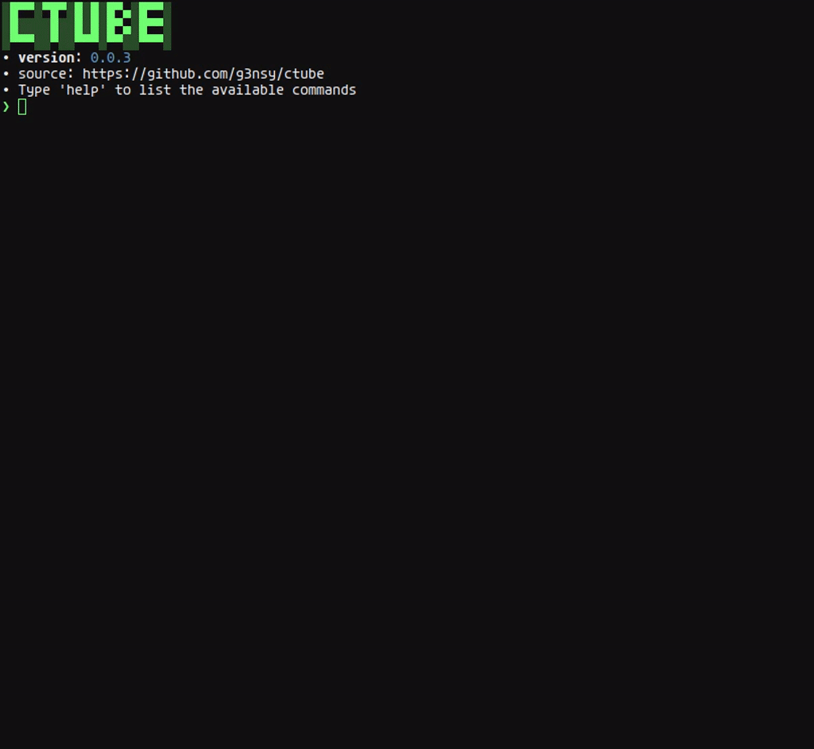

# ctube

[](https://en.wikipedia.org/wiki/MIT_License)

---
ctube is a simple program for downloading music. Written in Python, ctube has a command line interface.\
Download in mp3 at the highest quality available. Metadata is automatically embedded in files (including cover art).\
Type help for more information about the available commands and how they work.

### installation
```shell
pip install ctube
```

### usage
to run ctube just type ctube in the terminal and press enter.

---
<p align="center">
    
</p>

---

The program is in a stable state, however some features are missing such as:
- better artist search.
- configuration via file.
- better display of download status.
- possibility to choose the metadata to embed.
- possibility to choose the file format and other audio parameters.

---
Tested on Arch Linux:
- alacritty 0.13.2
- python 3.12.3
